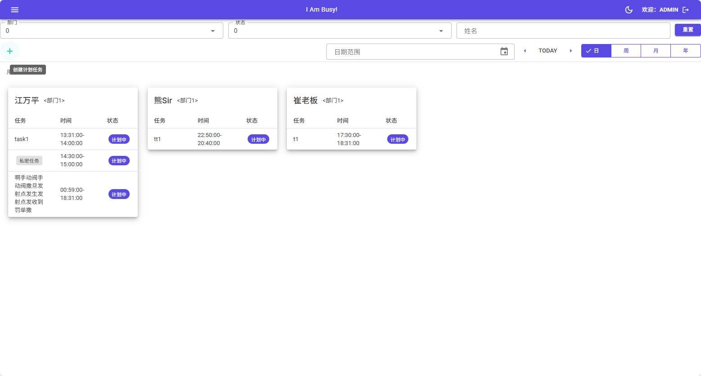

# 产品经理/项目经理/主管，请不要给我加活了，看看我的任务单吧！

# IAmBusy！

## 介绍
极简人员任务看板，让准备给你安排活的人先看看吧！平台完全基于.net core。相关核心依赖项目:

- [MudBlazor](https://github.com/MudBlazor/MudBlazor)：一款个人最喜欢的Blazor前端组件库。

## 操作文档

基本使用：
- 下载后使用VS 2022打开
- 编译运行IAmBusy项目，打开http://localhost:5090
- 或者直接下载打包好的publish包，双击IAmBusy.exe（linux下 dotnet IAmBusy.dll）运行

该项目是我们开发小团队自用的看板项目，非常适合作为.net体系练手和入门项目。
